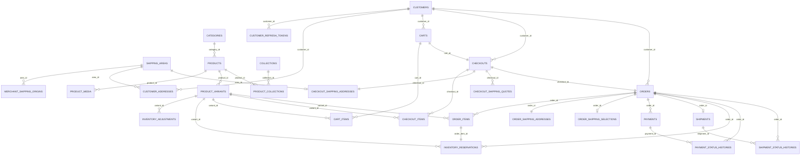

# E-Commerce Backend: ERD + Mapping Entity Spring Boot/JPA + Urutan Migrasi Flyway

Dokumen ini melanjutkan kontrak OpenAPI final dan schema PostgreSQL 18+ yang sudah disusun sebelumnya.

## 1) Prinsip desain yang dipakai

1. **Aggregate tetap sederhana**: product, cart, checkout, order, payment, shipment diperlakukan sebagai aggregate utama.
2. **Snapshot tetap dipertahankan**: cart → checkout → order tidak membaca data “live” untuk histori.
3. **JPA dipakai untuk OLTP utama**, bukan untuk semua query analitik/read model.
4. **JSONB tetap dipakai hanya untuk payload provider/audit**, bukan untuk field bisnis inti.
5. **Bidirectional relationship dibatasi** agar tidak bikin entity graph meledak, lazy proxy bikin pusing, lalu tim menyalahkan database padahal masalahnya di mapping.

---

## 2) ERD logis



---

## 3) Batas aggregate dan entity root yang disarankan

### Reference / Master
- `ShippingArea`
- `MerchantShippingOrigin`
- `Category`
- `Collection`

### Identity / Customer
- `Customer`
- `CustomerRefreshToken`
- `CustomerAddress`

### Catalog
- `Product`
- `ProductVariant`
- `ProductMedia`
- `ProductCollectionLink` *(join entity, jangan ManyToMany polos karena join table punya `created_at`)*

### Sales flow
- `Cart`
- `CartItem`
- `Checkout`
- `CheckoutItem`
- `CheckoutShippingAddress`
- `CheckoutShippingQuote`
- `Order`
- `OrderItem`
- `OrderShippingAddress`
- `OrderShippingSelection`

### Provider / Operations
- `Payment`
- `Shipment`
- `InventoryAdjustment`
- `InventoryReservation`
- `IdempotencyKeyRecord`
- `WebhookReceipt`
- `PaymentStatusHistory`
- `ShipmentStatusHistory`

### Read model
- `PublicProductSummaryView` *(opsional, read-only projection, bukan aggregate transaksi)*

---

## 4) Package structure Spring Boot yang saya rekomendasikan

```text
com.example.commerce
├── common
│   ├── config
│   ├── db
│   ├── jpa
│   ├── error
│   └── security
├── catalog
│   ├── domain
│   ├── repository
│   ├── service
│   └── web
├── customer
│   ├── domain
│   ├── repository
│   ├── service
│   └── web
├── cart
│   ├── domain
│   ├── repository
│   ├── service
│   └── web
├── checkout
│   ├── domain
│   ├── repository
│   ├── service
│   └── web
├── order
│   ├── domain
│   ├── repository
│   ├── service
│   └── web
├── payment
│   ├── domain
│   ├── repository
│   ├── provider
│   ├── service
│   └── web
├── shipping
│   ├── domain
│   ├── repository
│   ├── provider
│   ├── service
│   └── web
├── inventory
│   ├── domain
│   ├── repository
│   └── service
├── idempotency
│   ├── domain
│   ├── repository
│   └── service
└── webhook
    ├── domain
    ├── repository
    ├── service
    └── web
```

---

## 5) Mapping strategy JPA yang aman untuk schema ini

## 5.1 Base class audit
Pakai `@MappedSuperclass` untuk `createdAt` dan `updatedAt`, lalu aktifkan Spring Data JPA auditing.

```java
@MappedSuperclass
@EntityListeners(AuditingEntityListener.class)
public abstract class AuditableEntity {

    @CreatedDate
    @Column(name = "created_at", nullable = false, updatable = false)
    private Instant createdAt;

    @LastModifiedDate
    @Column(name = "updated_at", nullable = false)
    private Instant updatedAt;
}
```

Catatan:
- Untuk tabel yang memang hanya punya `created_at`, cukup pakai base lain misalnya `CreatedOnlyEntity`.
- Jangan paksa semua entity extend base yang sama kalau tabelnya memang tidak punya `updated_at`.

## 5.2 ID strategy
Schema SQL memakai default `uuidv7()` di PostgreSQL. Untuk JPA, rekomendasi paling aman adalah **assigned UUID** dari aplikasi saat `new entity`, sementara default DB tetap dipertahankan sebagai safety net pada operasi SQL non-JPA.

Contoh:

```java
@Id
@Column(name = "id", nullable = false, updatable = false)
private UUID id;

@PrePersist
void prePersist() {
    if (id == null) id = UuidV7Generator.next();
}
```

Alasannya sederhana: lifecycle JPA jauh lebih enak dikendalikan bila ID sudah ada sebelum `persist`, terutama untuk child entity, audit event, dan domain event.

## 5.3 Enum strategy
Semua enum map ke `varchar` pakai `@Enumerated(EnumType.STRING)`.

Jangan pakai ordinal. Itu cara cepat membuat bug yang nanti terlihat seperti “kok data lama berubah arti setelah deploy?”.

## 5.4 JSONB strategy
Untuk kolom `jsonb` seperti provider payload, map dengan Hibernate 6 memakai `@JdbcTypeCode(SqlTypes.JSON)`.

```java
@JdbcTypeCode(SqlTypes.JSON)
@Column(name = "provider_response_payload")
private JsonNode providerResponsePayload;
```

`JsonNode` aman untuk payload provider yang shape-nya bisa berubah. Untuk data yang stabil, boleh pakai typed embeddable/DTO.

## 5.5 Generated columns
Kolom generated seperti:
- `stock_available`
- `line_total_amount`
- `total_amount`

harus dipetakan `insertable = false, updatable = false`.

```java
@Column(name = "total_amount", insertable = false, updatable = false)
private Long totalAmount;
```

## 5.6 Relationship strategy
Aturan praktis:
- gunakan `LAZY` hampir di semua association;
- root → children yang lifecycle-nya owned: boleh `cascade = ALL` + `orphanRemoval = true`;
- child → parent: cukup `@ManyToOne(fetch = LAZY)`;
- hindari koleksi besar ke history tables dari root transaksi.

Artinya:
- `Order` **tidak perlu** punya `List<PaymentStatusHistory>` default;
- `Shipment` **tidak perlu** eager load history;
- `Customer` **tidak perlu** memegang semua cart/checkout/order sebagai collection JPA.

Buat query repository spesifik saat dibutuhkan. JPA bukan Pokémon; tidak semua relasi harus ditangkap sekaligus.

---

## 6) Rekomendasi mapping entity per tabel

## 6.1 Reference / master

### `shipping_areas` → `ShippingArea`
- PK: `areaId:String`
- Tidak perlu child collection ke alamat.
- Bisa diperlakukan semi-reference cache.

### `merchant_shipping_origins` → `MerchantShippingOrigin`
- `@ManyToOne(fetch = LAZY)` ke `ShippingArea`
- Query penting: origin default aktif.

### `categories` → `Category`
- `slug` unique business key.
- Tidak perlu `products` collection kecuali memang dipakai admin aggregate.

### `collections` → `Collection`
- Sama seperti category.

---

## 6.2 Customer

### `customers` → `Customer`
Field utama:
- `id: UUID`
- `email`
- `emailNormalized`
- `phone`
- `fullName`
- `passwordHash`
- `role`
- `isActive`
- `lastLoginAt`

Mapping:
- `emailNormalized` read-only.
- `passwordHash` jangan pernah expose ke response layer.

### `customer_refresh_tokens` → `CustomerRefreshToken`
- `@ManyToOne(fetch = LAZY)` ke `Customer`
- `replacedByToken` self-reference optional.
- Tidak perlu cascade dari `Customer` ke semua token untuk operasi rutin; cukup repository dedicated.

### `customer_addresses` → `CustomerAddress`
- `@ManyToOne(fetch = LAZY)` ke `Customer`
- `@ManyToOne(fetch = LAZY)` ke `ShippingArea`
- Rule default address tetap dijaga DB lewat partial unique index.

---

## 6.3 Catalog

### `products` → `Product`
Children owned:
- `List<ProductMedia> media`
- `List<ProductVariant> variants`
- `List<ProductCollectionLink> collections`

Disarankan:
- `@OneToMany(mappedBy = "product", cascade = ALL, orphanRemoval = true)` untuk media dan variants.
- Jangan expose entity langsung ke API; pakai DTO/projection.

### `product_media` → `ProductMedia`
- `@ManyToOne(fetch = LAZY)` ke `Product`
- urutkan dengan `sortOrder`

### `product_variants` → `ProductVariant`
Field penting:
- `sku`
- `status`
- `color`
- `sizeCode`
- `priceAmount`
- `compareAtAmount`
- `weightGrams`
- `stockOnHand`
- `stockReserved`
- `stockAvailable` read-only

### `product_collections` → `ProductCollectionLink`
- entity join eksplisit
- gunakan `@EmbeddedId` atau surrogate key? Untuk schema sekarang, paling bersih pakai `@EmbeddedId` (`productId`, `collectionId`).

---

## 6.4 Cart

### `carts` → `Cart`
Children owned:
- `List<CartItem> items`

Field penting:
- `customerId` nullable
- `accessTokenHash` nullable
- `status`
- `expiresAt`
- `itemCount`
- `subtotalAmount`

Catatan:
- `itemCount` dan `subtotalAmount` dijaga trigger DB; treat as persisted summary, bukan dihitung ulang di entity getter.

### `cart_items` → `CartItem`
- `@ManyToOne(fetch = LAZY)` ke `Cart`
- `@ManyToOne(fetch = LAZY)` ke `Product`
- `@ManyToOne(fetch = LAZY)` ke `ProductVariant`
- snapshot fields tetap disimpan sebagai kolom biasa
- `lineTotalAmount` read-only

---

## 6.5 Checkout

### `checkouts` → `Checkout`
Owned relations:
- `List<CheckoutItem> items`
- `CheckoutShippingAddress shippingAddress`
- `List<CheckoutShippingQuote> availableShippingQuotes`
- `CheckoutShippingQuote selectedShippingQuote` *(many-to-one by foreign key selected_shipping_quote_id)*

Mapping yang saya sarankan:
- `items` = `@OneToMany`
- `shippingAddress` = `@OneToOne(mappedBy = "checkout", cascade = ALL, orphanRemoval = true)`
- `availableShippingQuotes` = `@OneToMany`
- `selectedShippingQuote` = `@ManyToOne(fetch = LAZY)` dengan `@JoinColumn(name = "selected_shipping_quote_id")`

### `checkout_items` → `CheckoutItem`
Mirip `CartItem`, tetapi snapshot checkout.

### `checkout_shipping_addresses` → `CheckoutShippingAddress`
- PK = `checkout_id`
- shared primary key one-to-one dengan `Checkout`
- mapping enak pakai `@MapsId`

### `checkout_shipping_quotes` → `CheckoutShippingQuote`
- banyak quote per checkout
- payload provider simpan di `rawPayload`
- jangan dibuat child eager karena akan sering membengkak

---

## 6.6 Orders

### `orders` → `Order`
Owned relations:
- `List<OrderItem> items`
- `OrderShippingAddress shippingAddress`
- `OrderShippingSelection shippingSelection`

Optional relations:
- `Payment currentPayment`
- `Shipment shipment`

Field status:
- `status`
- `paymentStatus`
- `fulfillmentStatus`

Catatan penting:
- `currentPayment` sebaiknya `@OneToOne(fetch = LAZY)` opsional
- **jangan** mapping seluruh `payments` sebagai eager collection dari order
- kalau butuh histori payment, query terpisah dari repository

### `order_items` → `OrderItem`
- snapshot final item
- `lineTotalAmount` read-only

### `order_shipping_addresses` → `OrderShippingAddress`
- shared PK one-to-one dengan `Order`
- snapshot final alamat kirim

### `order_shipping_selections` → `OrderShippingSelection`
- shared PK one-to-one dengan `Order`
- snapshot final pilihan pengiriman

---

## 6.7 Payment / Shipment / Inventory / Audit

### `payments` → `Payment`
- `@ManyToOne(fetch = LAZY)` ke `Order`
- satu order bisa punya banyak payment attempt
- partial unique index sudah menjaga satu pending aktif per order
- `snapToken`, `snapRedirectUrl`, `provider*Payload` simpan di sini

### `shipments` → `Shipment`
- `@OneToOne(fetch = LAZY)` ke `Order`
- satu order maksimal satu shipment untuk MVP

### `inventory_adjustments` → `InventoryAdjustment`
- append-only log
- jangan dijadikan collection besar di `ProductVariant`

### `inventory_reservations` → `InventoryReservation`
- `@ManyToOne(fetch = LAZY)` ke `Order`
- `@OneToOne(fetch = LAZY)` ke `OrderItem`
- `@ManyToOne(fetch = LAZY)` ke `ProductVariant`

### `idempotency_keys` → `IdempotencyKeyRecord`
- managed by dedicated service
- tidak perlu hubungan entity ke semua resource target

### `webhook_receipts` → `WebhookReceipt`
- append-only inbound event store ringan
- payload JSONB

### `payment_status_histories` → `PaymentStatusHistory`
### `shipment_status_histories` → `ShipmentStatusHistory`
- append-only
- read dari repository saat support/admin perlu audit
- hindari collection default dari `Payment`/`Shipment` kalau tidak diperlukan

---

## 7) Entity skeleton yang disarankan

## 7.1 `Product`

```java
@Entity
@Table(name = "products", schema = "commerce")
public class Product extends AuditableEntity {

    @Id
    @Column(name = "id", nullable = false, updatable = false)
    private UUID id;

    @Column(name = "slug", nullable = false, unique = true, length = 100)
    private String slug;

    @Column(name = "title", nullable = false, length = 180)
    private String title;

    @Column(name = "subtitle", length = 180)
    private String subtitle;

    @Column(name = "brand_name", nullable = false, length = 120)
    private String brandName;

    @ManyToOne(fetch = FetchType.LAZY, optional = false)
    @JoinColumn(name = "category_id", nullable = false)
    private Category category;

    @Column(name = "description", nullable = false)
    private String description;

    @Enumerated(EnumType.STRING)
    @Column(name = "status", nullable = false, length = 20)
    private ProductStatus status;

    @Column(name = "published_at")
    private Instant publishedAt;

    @Column(name = "archived_at")
    private Instant archivedAt;

    @OneToMany(mappedBy = "product", cascade = CascadeType.ALL, orphanRemoval = true)
    private List<ProductMedia> media = new ArrayList<>();

    @OneToMany(mappedBy = "product", cascade = CascadeType.ALL, orphanRemoval = true)
    private List<ProductVariant> variants = new ArrayList<>();
}
```

## 7.2 `CheckoutShippingAddress`

```java
@Entity
@Table(name = "checkout_shipping_addresses", schema = "commerce")
public class CheckoutShippingAddress extends AuditableEntity {

    @Id
    @Column(name = "checkout_id", nullable = false)
    private UUID id;

    @MapsId
    @OneToOne(fetch = FetchType.LAZY)
    @JoinColumn(name = "checkout_id")
    private Checkout checkout;

    @ManyToOne(fetch = FetchType.LAZY)
    @JoinColumn(name = "customer_address_id")
    private CustomerAddress customerAddress;

    @ManyToOne(fetch = FetchType.LAZY, optional = false)
    @JoinColumn(name = "area_id", nullable = false)
    private ShippingArea area;

    @Column(name = "recipient_name", nullable = false, length = 120)
    private String recipientName;

    @Column(name = "phone", nullable = false, length = 30)
    private String phone;

    @Column(name = "line1", nullable = false, length = 200)
    private String line1;

    @Column(name = "line2", length = 200)
    private String line2;

    @Column(name = "notes", length = 200)
    private String notes;

    @Column(name = "district", nullable = false, length = 120)
    private String district;

    @Column(name = "city", nullable = false, length = 120)
    private String city;

    @Column(name = "province", nullable = false, length = 120)
    private String province;

    @Column(name = "postal_code", nullable = false, length = 20)
    private String postalCode;

    @Column(name = "country_code", nullable = false, length = 2)
    private String countryCode;
}
```

## 7.3 `Payment`

```java
@Entity
@Table(name = "payments", schema = "commerce")
public class Payment extends AuditableEntity {

    @Id
    @Column(name = "id", nullable = false, updatable = false)
    private UUID id;

    @ManyToOne(fetch = FetchType.LAZY, optional = false)
    @JoinColumn(name = "order_id", nullable = false)
    private Order order;

    @Enumerated(EnumType.STRING)
    @Column(name = "provider", nullable = false, length = 20)
    private PaymentProvider provider;

    @Enumerated(EnumType.STRING)
    @Column(name = "flow", nullable = false, length = 20)
    private PaymentFlow flow;

    @Enumerated(EnumType.STRING)
    @Column(name = "status", nullable = false, length = 20)
    private PaymentStatus status;

    @Column(name = "provider_order_id", nullable = false, unique = true, length = 50)
    private String providerOrderId;

    @Column(name = "provider_transaction_id", length = 100)
    private String providerTransactionId;

    @Column(name = "gross_amount", nullable = false)
    private Long grossAmount;

    @Column(name = "snap_token")
    private String snapToken;

    @Column(name = "snap_redirect_url")
    private String snapRedirectUrl;

    @JdbcTypeCode(SqlTypes.JSON)
    @Column(name = "provider_request_payload")
    private JsonNode providerRequestPayload;

    @JdbcTypeCode(SqlTypes.JSON)
    @Column(name = "provider_response_payload")
    private JsonNode providerResponsePayload;

    @Column(name = "expires_at")
    private Instant expiresAt;

    @Column(name = "paid_at")
    private Instant paidAt;
}
```

## 7.4 `PublicProductSummaryView`

```java
@Entity
@Immutable
@Table(name = "v_public_product_summaries", schema = "commerce")
public class PublicProductSummaryView {

    @Id
    @Column(name = "id", nullable = false)
    private UUID id;

    @Column(name = "slug")
    private String slug;

    @Column(name = "title")
    private String title;

    @Column(name = "brand_name")
    private String brandName;

    @Column(name = "category_slug")
    private String categorySlug;

    @Column(name = "primary_image_url")
    private String primaryImageUrl;

    @Column(name = "min_price_amount")
    private Long minPriceAmount;

    @Column(name = "max_price_amount")
    private Long maxPriceAmount;

    @Column(name = "in_stock")
    private Boolean inStock;
}
```

---

## 8) Repository boundaries yang saya sarankan

Jangan bikin satu `OrderRepository` lalu berharap dia menyelesaikan semua persoalan hidup.

Pisahkan begini:

### Catalog
- `ProductJpaRepository`
- `ProductVariantJpaRepository`
- `CategoryJpaRepository`
- `CollectionJpaRepository`
- `PublicProductSummaryViewRepository`

### Customer
- `CustomerJpaRepository`
- `CustomerRefreshTokenJpaRepository`
- `CustomerAddressJpaRepository`

### Cart / Checkout
- `CartJpaRepository`
- `CartItemJpaRepository`
- `CheckoutJpaRepository`
- `CheckoutShippingQuoteJpaRepository`

### Order / Payment / Shipment
- `OrderJpaRepository`
- `OrderItemJpaRepository`
- `PaymentJpaRepository`
- `ShipmentJpaRepository`
- `PaymentStatusHistoryJpaRepository`
- `ShipmentStatusHistoryJpaRepository`

### Inventory / Infra
- `InventoryAdjustmentJpaRepository`
- `InventoryReservationJpaRepository`
- `IdempotencyKeyJpaRepository`
- `WebhookReceiptJpaRepository`

Query kritis yang sebaiknya explicit:
- lock variants saat place order (`FOR UPDATE` via native query / custom repository)
- active cart by customer
- pending payment by order
- shipment by order
- admin order search dengan filter status

---

## 9) Urutan migrasi Flyway yang saya rekomendasikan

Di bawah ini saya **tidak** menyarankan semua schema dijadikan satu `V1__init.sql` raksasa, karena saat ada kegagalan review atau conflict, hidup tim jadi kurang syahdu. Yang lebih aman untuk proyek ini:

### Opsi yang paling sehat
- `V1__create_schema_and_extensions.sql`
- `V2__create_utility_functions.sql`
- `V3__create_reference_tables.sql`
- `V4__create_customer_tables.sql`
- `V5__create_catalog_tables.sql`
- `V6__create_cart_tables.sql`
- `V7__create_checkout_tables.sql`
- `V8__create_order_tables.sql`
- `V9__create_payment_and_shipment_tables.sql`
- `V10__create_inventory_tables.sql`
- `V11__create_idempotency_and_webhook_tables.sql`
- `V12__create_storefront_read_models.sql`
- `V13__seed_initial_reference_data.sql`
- `V14__seed_default_shipping_origin.sql`

### Kalau Anda tetap ingin format “V1 sampai Vn” yang lebih ringkas
- `V1__init_core_schema.sql`
- `V2__init_customer_and_catalog.sql`
- `V3__init_cart_checkout_order.sql`
- `V4__init_payment_shipping_inventory.sql`
- `V5__init_idempotency_webhook_and_views.sql`
- `V6__seed_reference_data.sql`

Saya pribadi lebih memilih **opsi pertama** karena lebih enak direview dan lebih gampang rollback secara operasional.

---

## 10) Detail isi migrasi per file

### `V1__create_schema_and_extensions.sql`
Isi:
- `CREATE SCHEMA commerce`
- `SET search_path`
- `CREATE EXTENSION pg_trgm`

### `V2__create_utility_functions.sql`
Isi:
- `touch_updated_at()`
- `sync_cart_totals()`

### `V3__create_reference_tables.sql`
Isi:
- `shipping_areas`
- `merchant_shipping_origins`
- `categories`
- `collections`
- trigger `updated_at`
- index unique/default origin

### `V4__create_customer_tables.sql`
Isi:
- `customers`
- `customer_refresh_tokens`
- `customer_addresses`
- index email normalized
- partial unique default address

### `V5__create_catalog_tables.sql`
Isi:
- `products`
- `product_collections`
- `product_media`
- `product_variants`
- trigram index katalog
- browse indexes

### `V6__create_cart_tables.sql`
Isi:
- `carts`
- `cart_items`
- trigger sync totals
- active cart constraint

### `V7__create_checkout_tables.sql`
Isi:
- `checkouts`
- `checkout_items`
- `checkout_shipping_addresses`
- `checkout_shipping_quotes`
- FK `selected_shipping_quote_id`

### `V8__create_order_tables.sql`
Isi:
- `orders`
- `order_items`
- `order_shipping_addresses`
- `order_shipping_selections`
- admin/customer order indexes

### `V9__create_payment_and_shipment_tables.sql`
Isi:
- `payments`
- `shipments`
- FK `orders.current_payment_id`
- pending payment partial unique index
- provider unique indexes

### `V10__create_inventory_tables.sql`
Isi:
- `inventory_adjustments`
- `inventory_reservations`

### `V11__create_idempotency_and_webhook_tables.sql`
Isi:
- `idempotency_keys`
- `webhook_receipts`
- `payment_status_histories`
- `shipment_status_histories`

### `V12__create_storefront_read_models.sql`
Isi:
- `v_public_product_summaries`

### `V13__seed_initial_reference_data.sql`
Isi:
- categories dasar
- collections dasar
- optional shipping area seed kecil hanya bila diperlukan

### `V14__seed_default_shipping_origin.sql`
Isi:
- merchant origin default untuk fulfilment awal

---

## 11) Repeatable migration yang masuk akal

Kalau memakai Flyway, saya sarankan hanya hal-hal berikut yang dibuat repeatable:
- `R__refresh_public_views.sql`
- `R__reference_seed_upserts.sql` *(kalau memang seed reference dijaga terus di repo)*

Selain itu, mayoritas perubahan schema tetap versioned migration biasa.

---

## 12) Aturan coding JPA yang saya rekomendasikan

1. **Jangan expose entity langsung ke controller**.
2. **DTO response terpisah dari entity**.
3. **Equals/hashCode berbasis ID stabil**, jangan berbasis semua field.
4. **Jangan cascade ke history/audit tables** dari root utama.
5. **Gunakan explicit fetch join atau projection** untuk query yang memang butuh graph.
6. **Lock stock dengan query repository khusus**, bukan berharap JPA magically memahami niat bisnis.
7. **Provider payload tetap JSONB**, tapi data bisnis inti tetap kolom normal.
8. **Business invariants penting tetap di DB**: unique, partial unique, check constraints.

---

## 13) Rekomendasi final yang saya tetapkan

### Final ERD posture
- Schema yang sudah dibuat **sudah layak** untuk MVP e-commerce yang serius.
- Relasi antar cart → checkout → order → payment/shipment **sudah tepat**.
- Snapshot approach **harus dipertahankan**, jangan dinormalisasi balik secara berlebihan.

### Final JPA posture
- Map **hanya aggregate utama dan child yang benar-benar owned**.
- History/audit/integration tables diperlakukan sebagai entity mandiri + repository khusus.
- View `v_public_product_summaries` boleh jadi read-only entity atau projection.

### Final Flyway posture
- Jangan jadikan semua perubahan masa depan ke satu file init.
- Mulai dari `V1...V14` seperti rekomendasi di atas.
- Setiap perubahan setelah production **roll-forward only**.

---

## 14) Deliverable implementasi berikutnya yang paling masuk akal

Kalau diteruskan ke tahap implementasi, urutan paling waras adalah:
1. buat **paket entity final**;
2. buat **repository + custom query lock stock**;
3. buat **mapping DTO request/response**;
4. buat **Flyway files fisik per versi**;
5. buat **service transaction boundary** untuk cart, checkout, order, payment webhook, shipment webhook.

